# Problem
When managing instances of observed non-compliance with Data handling policies, organizations often seek a way of mitigating potential over-exposure of data. In some cases, the mitigating control can be locking down a file’s permissions, but in other cases we may want to move these non-compliant files to a padded cell that will allow analysts to verify the risk of the data in the document before releasing it. This proverbial quarantine is implemented across many Data Loss Prevention solutions but through my experiences, this functionality is highly sought after but deficient within the Microsoft Information protection ecosystem and leaves some organizations in an uncomfortable situation. There does exist a functionality within Defender for Cloud Apps, but in some instances the scalability of this quarantine feature does not meet customer requirements due to 100 quarantine-action per day limitations.

# Solution
Resolving this deficiency requires a custom solution and fortunately Microsoft gives us the tools that would be needed to effectively implement a similar functionality with minimal knowledge of application development using Logic Apps and the Graph API. With a logic app, we can implement a low-code/no-code solution that provides a quarantine functionality with extensibility that allows for additional business logic to be implemented.
# Background

## What is Microsoft Information Protection (MIP)?
To manage data and its contents within the Microsoft 365 (M365) ecosystem, Microsoft has released numerous capabilities to help monitor and control information as it resides within SharePoint Online (SPO), OneDrive for Business (OD4B), Teams, Exchange Online (EXO). With the capabilities of MIP, we can search for specific data types within our environment through different inspection capabilities like Sensitive Information Types and Trainable Classifiers and protect them with response actions and sensitivity labels. Further information about MIP can be found at the following Microsoft documentation article: https://docs.microsoft.com/en-us/microsoft-365/compliance/information-protection?view=o365-worldwide

## What are Logic Apps?
Logic Apps are a serverless solution that allows for a workflow representation of an applications logic flow with event-based initialization. These events can then be handled according to required business logic through connectors which allow developers to interact with an input and produce and output. Out of the box, Logic Apps contain numerous connectors that not only allow for integration within Azure/M365, but with other third-party applications. For more information, check out the documentation here: https://docs.microsoft.com/en-us/azure/logic-apps/logic-apps-overview

## What is the Graph API?
The Graph API is an interconnected web of the behind-the-scenes data that drives Microsoft Productivity Applications. With Graph, we gain the ability to enumerate and interact with all manners of information within M365 like Users, Email, Files, or Calendars. More information on the Graph API can be found here: https://docs.microsoft.com/en-us/graph/overview

# Implementation

## Event generation
DLP policies within M365 generate alert data. This alert data is published in several different locations, but we need to be able to be selective of the content which we are ingesting because some policies will require a quarantine functionality while others do not. To initiate the Logic App we will need to leverage the O365 Management API and a webhook to start the workflow. 

### O365 Management API Subscription
To start, we will first need to create our Logic App within Azure to be able to retrieve the webhook URL for our subscription. This will of course imply that we have an active subscription to both Azure and Microsoft 365.

1. In Azure, search for and select Logic Apps.

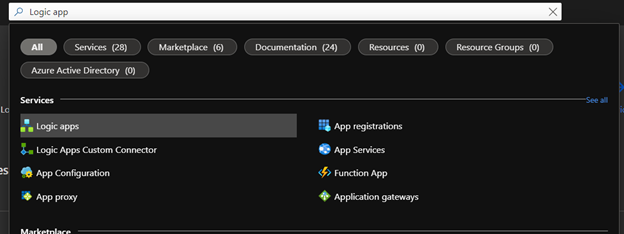

2. Select Add .

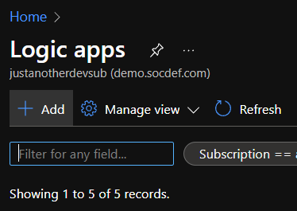

3. Create the logic app using the prompts, for testing use consumption. For production, use Standard.

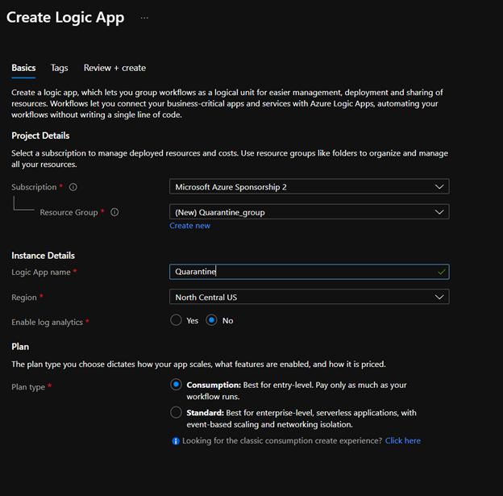

4. Once the Logic App is provisioned, access the resource and select Open Designer.

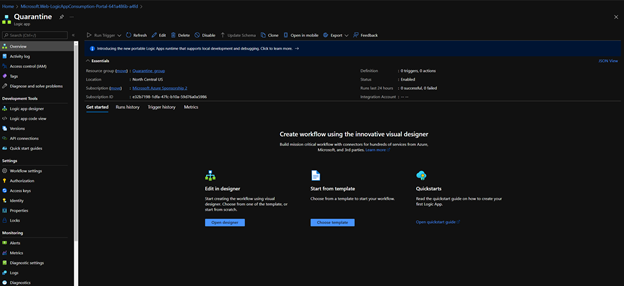

5. Once you're in the designer, you will be prompted to select a trigger. Select 'When a HTTP request is receieved.'

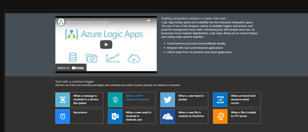

6. Now the designer will present you the new trigger, we will need to save the app in its current state to retrieve the webhook URL.

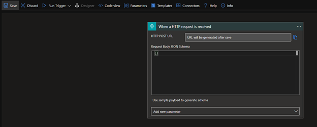

7. Once the Logic app is saved, we can re-open the designer and see that there is now a URL listed in the HTTP POST URL field of our trigger. 

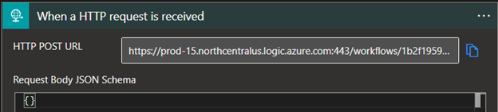

8.	 We can now use this URL to create a subscription to the Management API's DLP alerts feed. Using your REST client of choice, we will make a POST request to the management API. Using this API is outside of the scope of this document but you can refer to the official documentation here: https://docs.microsoft.com/en-us/office/office-365-management-api/office-365-management-activity-api-reference

POST Request URL: 
`https://manage.office.com/api/v1.0/{{TenantID}}/activity/feed/subscriptions/start?contentType=Dlp.ALL`

*Note: Replace {{TenantID}} with your AzureAD TenantID*

POST Request body:
~~~json
{
    "webhook": {
        "address": "<url_to_webhook>",
        "authId": "o365activityapinotification",
        "expiration": ""
    }
}
~~~
*Note: Populate the webhook.address field with the URL from the Logic App HTTP Trigger*

9.	 We can verify the subscription using a GET request 
GET Request URL: `https://manage.office.com/api/v1.0/{{TenantID}}/activity/feed/subscriptions/list`

*Note: Replace {{TenantID}} with your AzureAD TenantID*

You can also reference the following Postman calls for guidance:

Now that we have a valid subscription, we can start to develop our logic app. The O365 Management API will be sending our Logic App notifications of DLP policy matches as new matches are detected with the caveat that the data will be provided as a URL to a blob and that the blob will contain all DLP alerts, regardless of the source policy. Therefore, we have just added two additional steps to the logic app to fetch the blob and filter its contents.

### Data Structures
If we’re going to be handling data, it helps to know the data that we will be dealing with. There are two data structures that will be the primary supports for this Logic App, the Subscription Notification and the Alert Content. 

*Note: Both data types will come as an array regardless of whether there are multiple objects in each data type.* 
#### Subscription Notification Example
~~~json
[
    {
        "contentType": "Audit.SharePoint",
        "contentId":
        "492638008028$492638008028$f28ab78ad40140608012736e373933ebspo2015043022$4a81a7c326fc4aed89c62e6039ab833b$04",
        "contentUri": "https://manage.office.com/api/v1.0/f28ab78a-d401-4060-8012-736e373933eb/activity/feed/audit/492638008028$492638008028$f28ab78ad40140608012736e373933ebspo2015043022$4a81a7c326fc4aed89c62e6039ab833b$04",
        "contentCreated": "2015-05-23T17:35:00.000Z",
        "contentExpiration": "2015-05-30T17:35:00.000Z"
    }
]
~~~

#### Alert Content Example 
*Note: The following example is a bit messy in terms of content detection, this was by design. Personal information omitted.*
~~~json
[
  {
    "CreationTime": "2022-03-21T16:20:59",
    "Id": "8e20daec-17e1-4910-95cc-8907084d5366",
    "Operation": "DLPRuleMatch",
    "OrganizationId": "bbd10e79-3517-4c68-94dc-b722048636f0",
    "RecordType": 11,
    "UserKey": "DlpPolicyEventBasedAssistantSharePoint",
    "UserType": 4,
    "Version": 1,
    "Workload": "SharePoint",
    "ObjectId": "61d45f4b-fe45-4108-870e-d34fe9b4d82a",
    "UserId": "JOHN@CONTOSO.COM",
    "IncidentId": "bc7e89a0-ccd0-fdbc-f000-08da0b5970de",
    "PolicyDetails": [
      {
        "PolicyId": "9266d519-4537-4c37-b37c-fafa1d5403ae",
        "PolicyName": "Make Noise",
        "Rules": [
          {
            "ActionParameters": [
              "GenerateAlert:true"
            ],
            "Actions": [
              "GenerateAlert"
            ],
            "ConditionsMatched": {
              "ConditionMatchedInNewScheme": true,
              "SensitiveInformation": [
                {
                  "ClassifierType": "Content",
                  "Confidence": 85,
                  "Count": 1,
                  "SensitiveInformationDetailedClassificationAttributes": [
                    {
                      "Confidence": 65,
                      "Count": 1,
                      "IsMatch": false
                    },
                    {
                      "Confidence": 75,
                      "Count": 1,
                      "IsMatch": false
                    },
                    {
                      "Confidence": 85,
                      "Count": 1,
                      "IsMatch": true
                    }
                  ],
                  "SensitiveInformationDetections": {
                    "DetectedValues": [
                      {
                        "Name": "CreationTime",
                        "Value": "CreationTime 2022-03-21T16:15:59 Id cf9a77b2-ddce-46d4-9e93-b5427bf40c95 Operation DLPRuleMatch Orga"
                      }
                    ],
                    "ResultsTruncated": false
                  },
                  "SensitiveInformationTypeName": "Word",
                  "SensitiveType": "766b7053-6d13-4941-b35b-35190e9f2dfc"
                }
              ]
            },
            "ManagementRuleId": "0e4d7ce3-474f-4169-9cf3-004156ae6968",
            "RuleId": "8dedda1f-95ad-491d-babf-694689c90ac2",
            "RuleMode": "Enable",
            "RuleName": "Check for words",
            "Severity": "Low"
          }
        ]
      }
    ],
    "SensitiveInfoDetectionIsIncluded": true,
    "SharePointMetaData": {
      "FileID": "SPO_MjQ3MWQwZjktZDY1Ny00ODliLTgyMWItOTdiNDE1Zjc0ODE3LDZkMTYwM2E4LWU3YzEtNDZjMC1hYTY4LTZmNWNhZWNjNDZkMSxiOGVlMTY3My04YjY0LTRkMTktODQ3OC1kYTJhMjA3ZDFiOGY_01KAQ4MGSLL7KGCRP6BBAYODWTJ7U3JWBK",
      "FileName": "SPO-Test-2022-03-21T16_00_00.3831123Z.txt.txt.txt.txt.txt",
      "FileOwner": "John Smith",
      "FilePathUrl": "https://contoso.sharepoint.com/sites/contoso/Shared%20Documents/SPO-Test-2022-03-21T16_00_00.3831123Z.txt.txt.txt.txt.txt",
      "FileSize": 2409,
      "From": "JOHN@CONTOSO.COM",
      "IsViewableByExternalUsers": false,
      "IsVisibleOnlyToOdbOwner": false,
      "ItemCreationTime": "2022-03-21T16:20:32",
      "ItemLastModifiedTime": "2022-03-21T16:20:32",
      "ItemLastSharedTime": "0001-01-02T00:00:00",
      "SensitivityLabelIds": [],
      "SharedBy": [
        null
      ],
      "SiteAdmin": [],
      "SiteCollectionGuid": "2471d0f9-d657-489b-821b-97b415f74817",
      "SiteCollectionUrl": "https://contoso.sharepoint.com/sites/home",
      "UniqueID": "61d45f4b-fe45-4108-870e-d34fe9b4d82a"
    }
  }
]
~~~

Now that we have a data source and know our data, we can build out our workflow.

## Alert Aggregation Workflow
The following diagram outlines the logic flow for the Alert Aggregation phase of the app. During this phase, our Logic App will receive the Subscription Notification and iterate through all blob urls included in the body of the notification, appending all alerts from a blob to an array. 

### Logic App workflow
1. Provide the expected format of the data to our trigger for use later in the flow. 

The following JSON schema should be provided:
~~~json
{
    "items": {
        "properties": {
            "clientId": {
                "type": "string"
            },
            "contentCreated": {
                "type": "string"
            },
            "contentExpiration": {
                "type": "string"
            },
            "contentId": {
                "type": "string"
            },
            "contentType": {
                "type": "string"
            },
            "contentUri": {
                "type": "string"
            },
            "tenantId": {
                "type": "string"
            }
        },
        "required": [
            "clientId",
            "contentCreated",
            "contentExpiration",
            "contentId",
            "contentType",
            "contentUri",
            "tenantId"
        ],
        "type": "object"
    },
    "type": "array"
}
~~~

1. Since we can receive multiple Subscription Notifications, we will need to create an array to store the data from each individual notificiation. 
   

3. Now we can start to parse out the data. To do this, we will need a for each loop that iterates through the notifications, pulls the data from the blob URL, and appends it to the variable. We will use the body of our HTTP Trigger for the loop. 

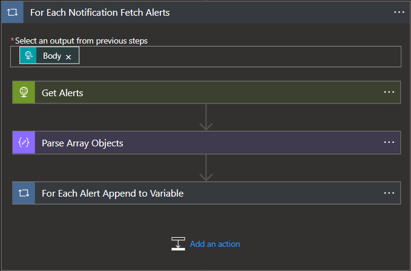

4. Within the for each loop, we will first fetch the alerts from the blob URL by invoking an HTTP GET request to the blob URL provided in the body of the notification. In this request I use an Azure Managed Identity to initiate the request, this helps to secure the applications identity and reduce maintenance complexities. If you're using a Managed Identity then the Authentication JSON field within the web request will reflect the following:
~~~json
{
  "audience": "https://manage.office.com/",
  "type": "ManagedServiceIdentity"
}
~~~

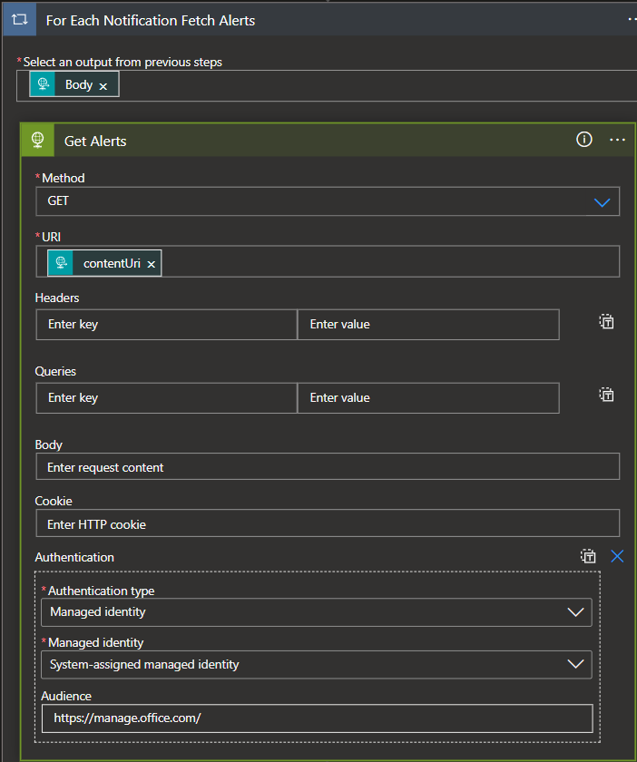

5. Once the data is fetched, we will then need to pick apart the alert array that was provided by the blob so that we can populate our alert array with individual alerts instead of appending the array with arrays. Since we don't need to worry about the data in the alerts at this point, we will simply parse the array and pull out the individual objects contained therein. 

~~~json
{
    "items": {
        "properties": {},
        "required": [],
        "type": "object"
    },
    "type": "array"
}
~~~

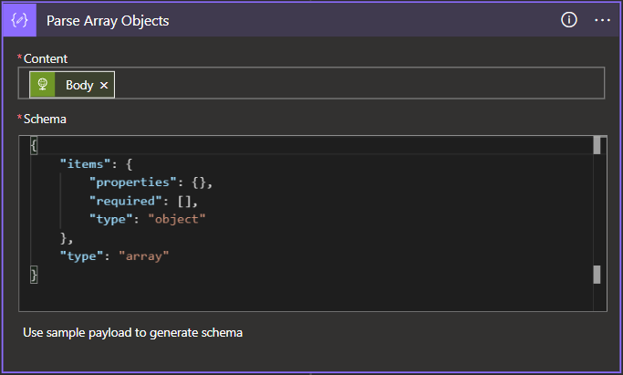

6. Once the alerts are parsed out as individual objects, we can then throw them into a for each loop based on the content of the JSON parse action above and append them to our array.

7. Finally, we can take the contents of our alert array and parse out the fields for use in the quarantine logic.

The following JSON schema should be provided:
~~~json
{
    "items": {
        "properties": {
            "CreationTime": {
                "type": "string"
            },
            "Id": {
                "type": "string"
            },
            "IncidentId": {
                "type": "string"
            },
            "ObjectId": {
                "type": "string"
            },
            "Operation": {
                "type": "string"
            },
            "OrganizationId": {
                "type": "string"
            },
            "PolicyDetails": {
                "items": {
                    "properties": {
                        "PolicyId": {
                            "type": "string"
                        },
                        "PolicyName": {
                            "type": "string"
                        },
                        "Rules": {
                            "items": {
                                "properties": {
                                    "ActionParameters": {
                                        "items": {
                                            "type": "string"
                                        },
                                        "type": "array"
                                    },
                                    "Actions": {
                                        "items": {
                                            "type": "string"
                                        },
                                        "type": "array"
                                    },
                                    "ConditionsMatched": {
                                        "properties": {
                                            "ConditionMatchedInNewScheme": {
                                                "type": "boolean"
                                            },
                                            "SensitiveInformation": {
                                                "items": {
                                                    "properties": {
                                                        "ClassifierType": {
                                                            "type": "string"
                                                        },
                                                        "Confidence": {
                                                            "type": "integer"
                                                        },
                                                        "Count": {
                                                            "type": "integer"
                                                        },
                                                        "SensitiveInformationDetailedClassificationAttributes": {
                                                            "items": {
                                                                "properties": {
                                                                    "Confidence": {
                                                                        "type": "integer"
                                                                    },
                                                                    "Count": {
                                                                        "type": "integer"
                                                                    },
                                                                    "IsMatch": {
                                                                        "type": "boolean"
                                                                    }
                                                                },
                                                                "required": [
                                                                    "Confidence",
                                                                    "Count",
                                                                    "IsMatch"
                                                                ],
                                                                "type": "object"
                                                            },
                                                            "type": "array"
                                                        },
                                                        "SensitiveInformationDetections": {
                                                            "properties": {
                                                                "DetectedValues": {
                                                                    "items": {
                                                                        "properties": {
                                                                            "Name": {
                                                                                "type": "string"
                                                                            },
                                                                            "Value": {
                                                                                "type": "string"
                                                                            }
                                                                        },
                                                                        "required": [
                                                                            "Name",
                                                                            "Value"
                                                                        ],
                                                                        "type": "object"
                                                                    },
                                                                    "type": "array"
                                                                },
                                                                "ResultsTruncated": {
                                                                    "type": "boolean"
                                                                }
                                                            },
                                                            "type": "object"
                                                        },
                                                        "SensitiveInformationTypeName": {
                                                            "type": "string"
                                                        },
                                                        "SensitiveType": {
                                                            "type": "string"
                                                        }
                                                    },
                                                    "required": [
                                                        "ClassifierType",
                                                        "Confidence",
                                                        "Count",
                                                        "SensitiveInformationDetailedClassificationAttributes",
                                                        "SensitiveInformationDetections",
                                                        "SensitiveInformationTypeName",
                                                        "SensitiveType"
                                                    ],
                                                    "type": "object"
                                                },
                                                "type": "array"
                                            }
                                        },
                                        "type": "object"
                                    },
                                    "ManagementRuleId": {
                                        "type": "string"
                                    },
                                    "RuleId": {
                                        "type": "string"
                                    },
                                    "RuleMode": {
                                        "type": "string"
                                    },
                                    "RuleName": {
                                        "type": "string"
                                    },
                                    "Severity": {
                                        "type": "string"
                                    }
                                },
                                "required": [
                                    "ActionParameters",
                                    "Actions",
                                    "ConditionsMatched",
                                    "ManagementRuleId",
                                    "RuleId",
                                    "RuleMode",
                                    "RuleName",
                                    "Severity"
                                ],
                                "type": "object"
                            },
                            "type": "array"
                        }
                    },
                    "required": [
                        "PolicyId",
                        "PolicyName",
                        "Rules"
                    ],
                    "type": "object"
                },
                "type": "array"
            },
            "RecordType": {
                "type": "integer"
            },
            "SensitiveInfoDetectionIsIncluded": {
                "type": "boolean"
            },
            "SharePointMetaData": {
                "properties": {
                    "FileName": {
                        "type": "string"
                    },
                    "FileOwner": {
                        "type": "string"
                    },
                    "FilePathUrl": {
                        "type": "string"
                    },
                    "FileSize": {
                        "type": "integer"
                    },
                    "From": {
                        "type": "string"
                    },
                    "IsViewableByExternalUsers": {
                        "type": "boolean"
                    },
                    "IsVisibleOnlyToOdbOwner": {
                        "type": "boolean"
                    },
                    "ItemCreationTime": {
                        "type": "string"
                    },
                    "ItemLastModifiedTime": {
                        "type": "string"
                    },
                    "ItemLastSharedTime": {
                        "type": "string"
                    },
                    "SensitivityLabelIds": {
                        "type": "array"
                    },
                    "SharedBy": {
                        "items": {},
                        "type": "array"
                    },
                    "SiteAdmin": {
                        "type": "array"
                    },
                    "SiteCollectionGuid": {
                        "type": "string"
                    },
                    "SiteCollectionUrl": {
                        "type": "string"
                    },
                    "UniqueID": {
                        "type": "string"
                    }
                },
                "type": "object"
            },
            "UserId": {
                "type": "string"
            },
            "UserKey": {
                "type": "string"
            },
            "UserType": {
                "type": "integer"
            },
            "Version": {
                "type": "integer"
            },
            "Workload": {
                "type": "string"
            }
        },
        "required": [
            "CreationTime",
            "Id",
            "Operation",
            "OrganizationId",
            "RecordType",
            "UserKey",
            "UserType",
            "Version",
            "Workload",
            "ObjectId",
            "UserId",
            "IncidentId",
            "PolicyDetails",
            "SensitiveInfoDetectionIsIncluded",
            "SharePointMetaData"
        ],
        "type": "object"
    },
    "type": "array"
}
~~~
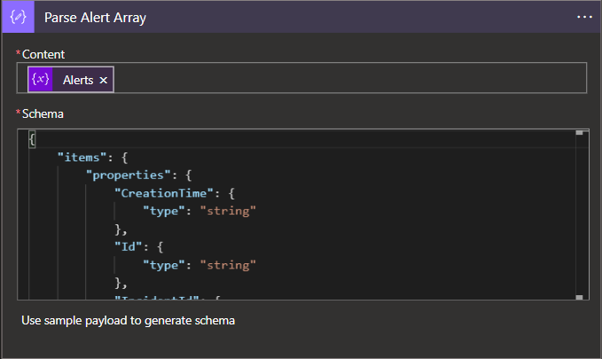

## Acting on Alert Content
Now that we have actionable data, we can finally jump into the primary logic of this workflow whose sole purpose is to take files from one location and move it to another. This is where we will apply our filtering for the specific policies which we identify as requiring the Quarantine action.

1. Since we have a batch of alert content to go through, we will need to pass our alert array into a for each loop. 

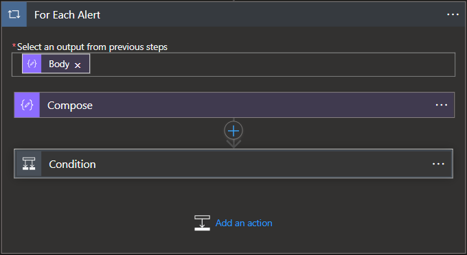

2. To filter the alerts by policy, we will first need to know which policy triggered the alert based upon the PolicyID. This field is included in the alert data, however, to be able to reference it we need to perform some lookups on our data set since the PolicyID field is not a selectable variable. In my flow, I used a variable to manage this lookup but this can be done inline within the conditional statement as well. 

Expression:
`items('For_Each_Alert')['PolicyDetails'][0]?['PolicyId']`

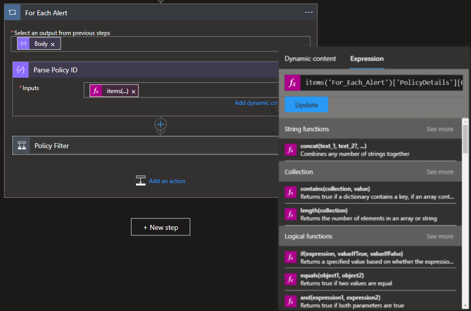 

3. The now enumerated PolicyID can then be passed into a conditional block where we can define the policies which we will apply quarantine actions to while referencing the previously enumerated PolicyID of an alert. If you're unsure of the PolicyID, these can be retrieved using the `Get-DLPCCompliancePolicy` (Ref:https://docs.microsoft.com/en-us/powershell/module/exchange/get-dlpcompliancepolicy?view=exchange-ps)

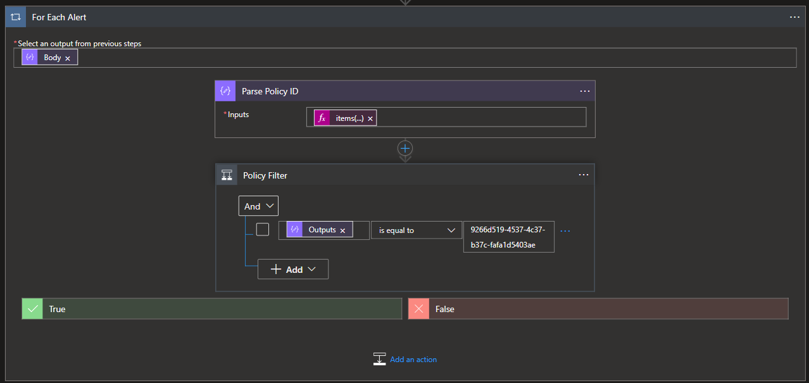

4. Once we've filtered out the policies, we can then start quarantining files...or not! I am expecting these policies to trigger on both OneDrive and Sharepoint and as such, we will have different logic flows. We can reference the `Workload` field of the alert to determine which flow the Logic App will follow. 

*Note: At the time of writing, this POC implementation was done using two seperate workflows for OneDrive and SharePoint policy matches. In the future, this will be updated to use a singular flow to simplify the application logic.*

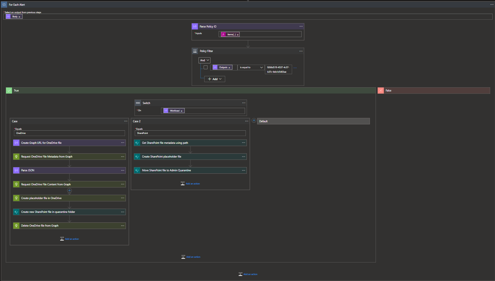

### OneDrive Quarantine Flow
A caveat of using the Logic App's OneDrive Connector is that we would only be able to take action on files which occurred in the author's OneDrive site since the connector only authorizes us access to our site. To circumvent this issue, we can use the Graph API.

*NOTE: In this current iteration, the quarantined OneDrive file will lose versioning history, this should be fixed in the next update.*

1. Within the OneDrive Flow, we need to get the definitive URL for the file as it exists within the Graph API. Instantiating a new variable to track this URL will help in follow-on actions. This URL can be built from the `SiteCollectionGuid` alert field and the file URL that we have in the alert's `FilePathURL` field, however, we will only need the portion of the URL that follows "/Documents/" and will need to manipulate the string using a function.

Dynamic Expression for the file path:
`https://graph.microsoft.com/v1.0/sites/@{items('For_Each_Alert')?['SharePointMetaData']?['SiteCollectionGuid']}/drive/root:@{replace(items('For_Each_Alert')?['SharePointMetadata']?['FilePathUrl'], concat(items('For_Each_Alert')?['SharePointMetadata']?['SiteCollectionUrl'], '/Documents'), '')}`

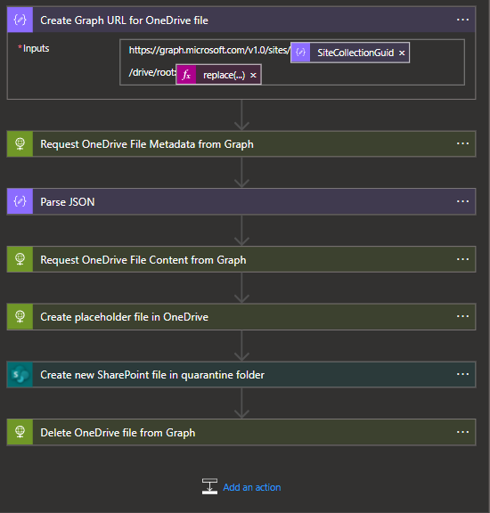

2. Once we have the file's URL, we will want to grab the file Metadata. Fetching this Metadata will afford us the opportunity to grab the file's `downloadUrl` as it exists within the Graph API. 

3. The body of the file metadata HTTP request will then need to be parsed out according to the below schema.

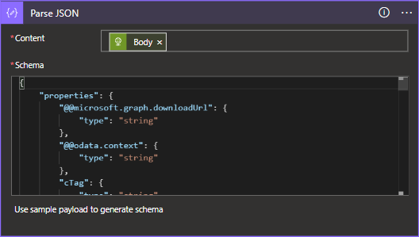

#### OD File Metadata Schema
~~~json
{
    "properties": {
        "@@microsoft.graph.downloadUrl": {
            "type": "string"
        },
        "@@odata.context": {
            "type": "string"
        },
        "cTag": {
            "type": "string"
        },
        "createdBy": {
            "properties": {
                "user": {
                    "properties": {
                        "displayName": {
                            "type": "string"
                        },
                        "email": {
                            "type": "string"
                        },
                        "id": {
                            "type": "string"
                        }
                    },
                    "type": "object"
                }
            },
            "type": "object"
        },
        "createdDateTime": {
            "type": "sng"
        },
        "eTag": {
            "type": "string"
        },
        "file": {
            "properties": {
                "hashes": {
                    "properties": {
                        "quickXorHash": {
                            "type": "string"
                        }
                    },
                    "type": "object"
                },
                "mimeType": {
                    "type": "string"
                }
            },
            "type": "object"
        },
        "fileSystemInfo": {
            "properties": {
                "createdDateTime": {
                    "type": "string"
                },
                "lastModifiedDateTime": {
                    "type": "string"
                }
            },
            "type": "object"
        },
        "id": {
            "type": "string"
        },
        "lastModifiedBy": {
            "properties": {
                "user": {
                    "properties": {
                        "displayName": {
                            "type": "string"
                        },
                        "email": {
                            "type": "string"
                        },
                        "id": {
                            "type": "string"
                        }
                    },
                    "type": "object"
                }
            },
            "type": "object"
        },
        "lastModifiedDateTime": {
            "type": "string"
        },
        "name": {
            "type": "string"
        },
        "parentReference": {
            "properties": {
                "driveId": {
                    "type": "string"
                },
                "driveType": {
                    "type": "string"
                },
                "id": {
                    "type": "string"
                },
                "path": {
                    "type": "string"
                }
            },
            "type": "object"
        },
        "shared": {
            "properties": {
                "scope": {
                    "type": "string"
                }
            },
            "type": "object"
        },
        "size": {
            "type": "integer"
        },
        "webUrl": {
            "type": "string"
        }
    },
    "type": "object"
}
~~~

4. Now that we have an object that we can work with, we will first want to fetch the actual content of the file using the `@microsoft.graph.downloadUrl` field within the file metadata. 

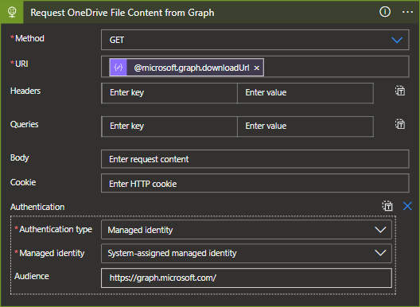

5. As a safe measure, we will take all remedial actions after we can ensure that a placeholder file exists and that the quarantined file has been created. To create my placeholder file, I simply used the alert information gathered from the DLP alert but this could include any data deemed useful to users. 

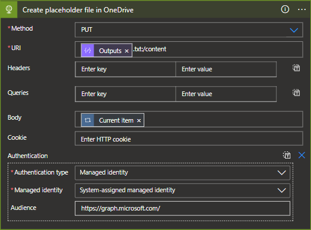

6. We can now leverage our Sharepoint Online connector to connect to our destination site. We will need to provide a filename and reference the body of our file download action as the file content.

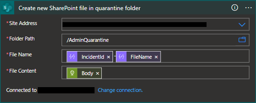

7. Once the placeholder and quarantine files are created, we can safely delete the file by calling the file endpoint in Graph using the DELETE method.

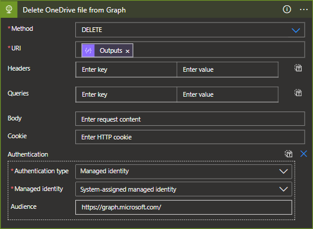
   
### SharePoint Quarantine Flow
Since our data in SharePoint is moving from one location inside of SharePoint to another, our flow is a bit simpler and simply moves the file while leaving a placeholder to notify users.

1. To be able to manipulate the files in Sharepoint, we will first need to grab some file metadata with the caveat that we'll need to use some creative string manipulation. Specifically, we'll need to provide a filepath that is derived from the `FilePathUrl` in our alert, but remove the HTML encoding for spaces. 

#### File Path Expression
`replace(replace(items('For_Each_Alert')?['SharePointMetadata']?['FilePathUrl'],items('For_Each_Alert')?['SharePointMetadata']?['SiteCollectionUrl'],''),'%20',' ')`

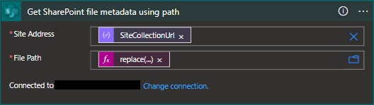

2. With the file metadata we can now manipulate the file within sharepoint. First we will create our placeholder file using expressions derived  from the current file's metadata. 

#### Folder Path Expression
`replace(body('Get_SharePoint_file_metadata_using_path')?['Path'],body('Get_SharePoint_file_metadata_using_path')?['DisplayName'],'')`
#### File Name Expression
`concat(body('Get_SharePoint_file_metadata_using_path')?['Name'],'.txt')`

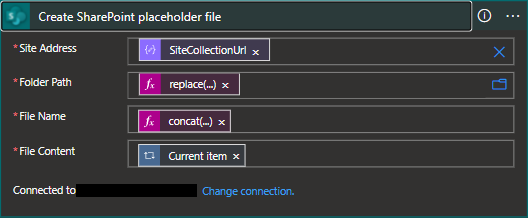

3. Finally, we will take the offending file and simply move it to our quarantine folder.

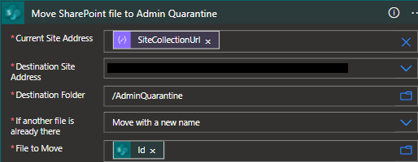